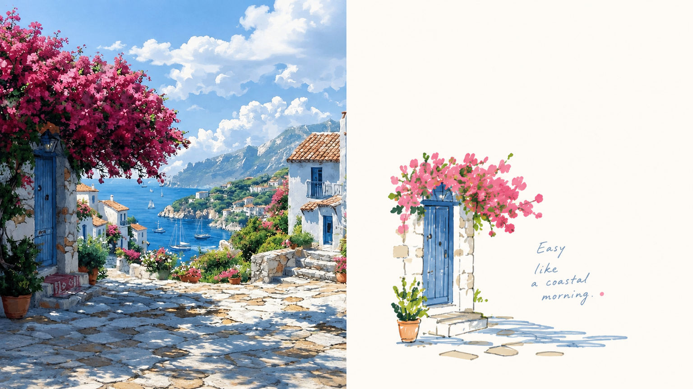
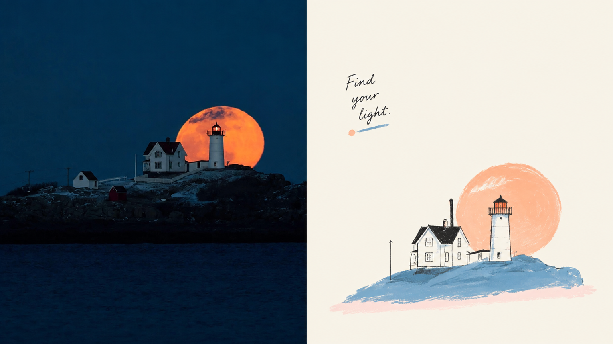
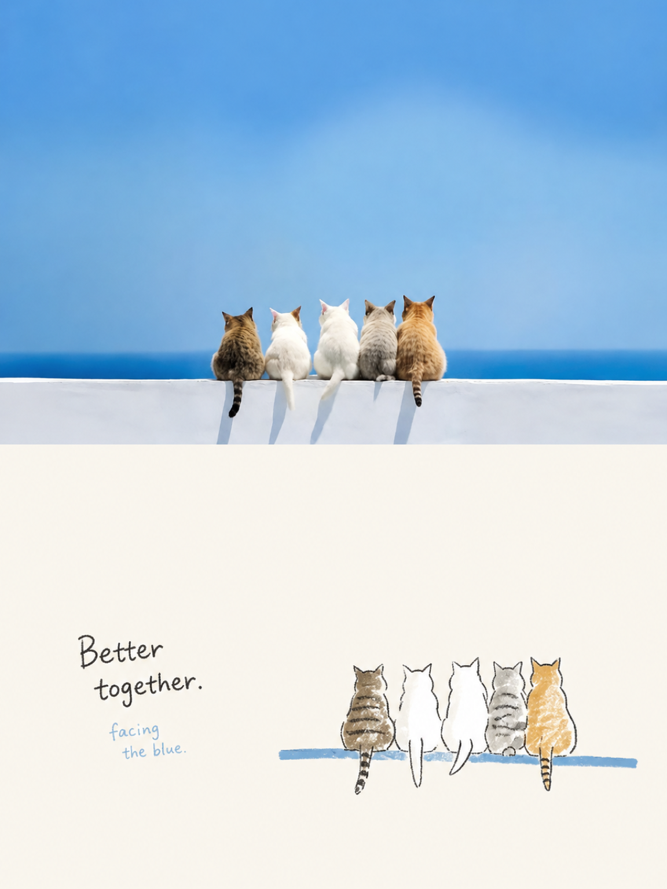
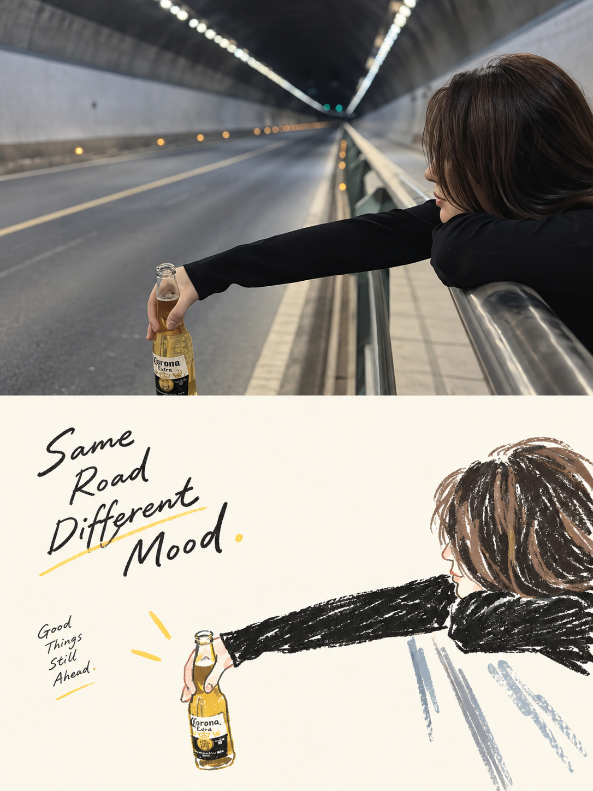
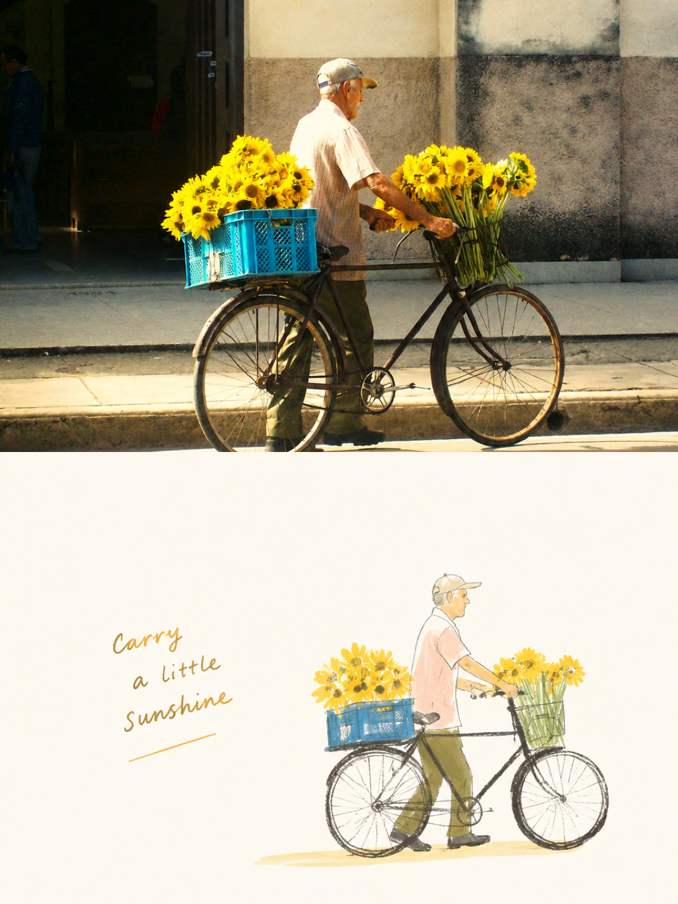
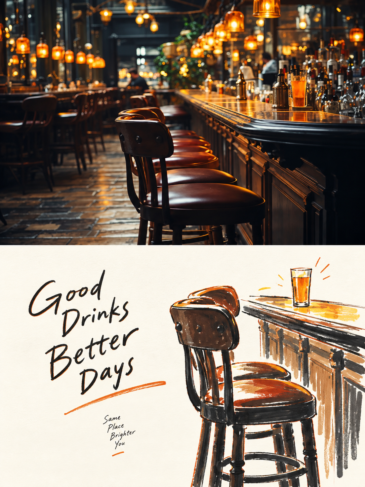

<div align="center">

# XXD Panel 121｜라이프스타일 두들 편집지

일상의 작은 감정을 넉넉한 여백과 영리한 그림·글 관계를 가진 일러스트로 만듭니다.

<a href="README.md">简体中文</a> · <a href="README.en.md">English</a> · <a href="README.ja.md">日本語</a> · <a href="README.ko.md">한국어</a> · <a href="README.ar.md">العربية</a>

</div>

## 샘플 작품

本项目已发布 8 张实际样片，图片文件位于 `assets/examples/`。

| sample-05 | sample-06 |
| --- | --- |
|  |  |
| sample-07 | sample-08 |
|  |  |
| sample-09 | sample-10 |
|  |  |
| sample-11 | sample-12 |
|  |  |

## 잘 맞는 상황과 해결하는 문제

일상 사진에 매력적인 자세나 관계가 있어도 평범한 구도와 복잡한 배경 때문에 묻힐 수 있습니다. **Panel 121**은 사진의 정체성을 지키면서 가장 식별력 있는 피사체를 추출하고, 편안한 마커풍 두들, 편집된 손글씨, 매우 많은 여백으로 성숙한 작품을 만듭니다.

### 잘 맞는 용도

- 인물, 일상 물건, 생활 장면을 독립 잡지나 라이프스타일 editorial illustration으로 전환합니다.
- 윤곽, 자세, 서사적 관계를 보존하면서 배경과 부차적인 물체 대부분을 제거합니다.
- 소박한 손그림의 편안함과 그림·글·빈 공간의 성숙한 편집을 함께 원할 때 사용합니다.
- 상하, 좌우, 디자인 단독, 여러 비율, 배경화면, 폴더 일괄의 일관된 결과물을 제공합니다.

### 해결하는 문제

- 덜어내기, 재배열, 자르기, 크기 변경으로 평범한 사진에 새 시각적 중심을 만듭니다.
- 그림과 글이 보이지 않는 그리드, 시각 축, 읽기 경로를 공유하여 “위에 한 문장, 아래에 인물”을 피합니다.
- 작은 도형과 많은 여백으로 거리·쉼·호흡을 만들며 작은 아이콘으로 빈 곳을 채우지 않습니다.
- 비교 이미지는 두 개의 50:50 영역만 사용하고 현재 원본에서 직접 생성하여 제3의 띠와 이중 변환을 막습니다.

## 사용 팁

- **선명한 사진 한 장부터 시작하세요:** 피사체, 동작, 관계가 잘 보이는 이미지를 고른 뒤 출력 방식과 비율을 정합니다.
- **파라미터를 한 문장으로 연결하세요:** “상하 / 좌우 / 순수 디자인 + 16:9 / 3:4 / 휴대폰 배경화면”처럼 말하고 컴퓨터·태블릿·스마트워치 크기도 덧붙일 수 있습니다.
- **남겨야 할 것을 분명히 하세요:** 인물, 사물, 동작, 관계, 문구를 지정하되 레이아웃을 지나치게 고정하지 않아야 스타일이 자연스럽게 설계합니다.
- **텍스트 방식을 고르세요:** 이미지에서 지능적으로 생성하게 하거나, `--text exact --copy`로 정확한 문구를 고정하거나, `--text none`으로 글자를 없앨 수 있습니다.
- **사진 영역과 디자인 영역을 설명하세요:** 상하·좌우에서는 사진을 남길 쪽과 다시 디자인할 쪽을 말하고, 순수 디자인·배경화면은 전체 캔버스를 다시 설계한다고 알려 주세요.
- **한 장을 먼저 시험한 뒤 일괄 처리하세요:** 모드, 비율, 텍스트, 언어를 한 장에서 확인하고 같은 설정을 폴더에 적용합니다. 비교를 위해 한 번에 한 변수만 바꾸세요.

## 원본 프롬프트 · 5개 언어

[简体中文](references/original-prompt/zh-CN.md) · [English](references/original-prompt/en.md) · [日本語](references/original-prompt/ja.md) · [한국어](references/original-prompt/ko.md) · [العربية](references/original-prompt/ar.md)

중국어 파일은 사용자의 원문을 글자 그대로 보존하며 실행 시 창작과 미적 판단의 유일한 기준입니다. 다른 네 언어는 완전하고 충실한 열람용 번역이며 생성 지시를 다시 쓰지 않습니다.

**특징:** 소박한 라이프스타일 일러스트 · 마커/크레용/오일파스텔 질감 · 보이지 않는 그리드 · 그림·글 통합 편집 · 가볍고 자연스러운 손글씨 · 원본 기반 제한 색상 · 매우 많은 여백

## 빠른 적합성 확인

| 궁금한 점 | Panel 121의 처리 |
|---|---|
| 사진 구도가 평범해도 되나요? | 가장 식별력 있는 관계를 지키면서 위치, 자르기, 크기를 다시 연출합니다. |
| 두들이 유치하지 않을까요? | 소박한 그림에 성숙한 구도를 결합하고 어린이 스크랩북, 저렴한 만화, 템플릿을 피합니다. |
| 글이 항상 중앙인가요? | 윤곽, 동작, 어깨선, 네거티브 스페이스에 맞춰 비대칭으로 호응합니다. |
| 다양한 납품 형식이 가능한가요? | 네 모드, 일반 비율, 정확한 픽셀, 원본별 독립 폴더 일괄 처리를 지원합니다. |

## 네 가지 출력 모드

- `top-bottom`: 전폭 상하 두 영역만 사용합니다. 실제 사진은 위, 디자인은 아래에 정확히 50%씩 둡니다.
- `left-right`: 전고 좌우 두 영역만 사용합니다. 실제 사진은 왼쪽, 디자인은 오른쪽에 정확히 50%씩 두며 상하 구도로 돌리지 않습니다.
- `design-only`: 전체 캔버스에 Panel 121의 디자인 번역만 표시하고 사진은 보이지 않는 참고 자료로 사용합니다.
- `wallpaper-pack`: 휴대폰, iPad, 데스크톱, 시계용 완성 이미지를 각각 만들며 `linked` 또는 `independent`를 선택합니다.

모드와 크기는 여러 개 선택할 수 있습니다. `1:1`, `3:4`, `4:3`, `4:5`, `5:4`, `2:3`, `3:2`, `9:16`, `16:9`, `21:9`, `5:7`, `7:5`, 정확한 픽셀을 지원합니다. 텍스트는 모델 생성, 사용자 원문, 없음 중에서 선택합니다. 폴더 입력은 각 소스를 분리 처리하고 최종 PNG를 하나의 새 작업 폴더에 평면으로 저장합니다.

## 시작하기

```bash
git clone https://github.com/nevertoday/xxd-panel-121.git
npx skills add https://github.com/nevertoday/xxd-panel-121 --skill xxd-panel-121
```

설치 후 Agent 세션을 다시 시작하고 `$xxd-panel-121`을 호출하세요. 사용자 단위 Codex 설치에는 `--global --agent codex --yes`를 추가할 수 있습니다.

```text
/xxd-panel-121 photo.jpg --mode top-bottom --size 3:4 --text prompt --locale ko-KR
/xxd-panel-121 photo.jpg --mode left-right --size 16:9 --text prompt --locale en-US
/xxd-panel-121 photo.jpg --mode design-only --size 9:16 --text none
```

전체 실행 계약은 [SKILL.md](SKILL.md), 런타임 어댑터는 [영어](references/xxd-panel-121-prompt.en.md)와 [중국어](references/xxd-panel-121-prompt.zh-CN.md)를 확인하세요.

<!-- xxd-readme-ads:start -->
## XXD 소개

XXD는 Xiaoxiaodong 브랜드 이름의 약자입니다. 이 프로젝트는 [@xiaoxiaodong01](https://x.com/xiaoxiaodong01)이 만들고 관리합니다.

## Xiaoxiaodong 멀티플랫폼 멤버십 · CNY 699/년

> **광고 안내:** 아래 QR 코드와 멤버십·유료 서비스 링크는 XXD의 홍보 정보입니다. 스캔이나 구매는 선택 사항이며 오픈 소스 이용에는 영향을 주지 않습니다.

연간 멤버십 하나로 **Knowledge Planet + XXD 회원 프롬프트 라이브러리 + 모든 General Skills 멤버십**을 함께 이용할 수 있습니다. 각각 따로 구매할 필요가 없습니다.

<!-- xxd-panel-command-system:start -->

### Skills가 함께 작동하는 방식

| 등급 | 포함 내용 | 역할 |
|---|---|---|
| **General** | [`xxd-panel-all`](https://github.com/xiaoxiaodong-ai/xxd-panel-all) | 사용 가능한 번호형 Skills를 찾고, 이미지·주제·용도에 맞춰 추천하며, 여러 스타일과 일괄 작업을 정리합니다. |
| **Soldier** | `xxd-panel-NNN` | 각 번호가 고유한 원본 프롬프트와 미학에 따라 General이 배정한 구체적인 작업을 완성합니다. |

<!-- xxd-panel-command-system:end -->

### 회원 혜택

1. **Xiaoxiaodong을 AI 학습 상담자로**
   [Knowledge Planet](https://wx.zsxq.com/group/15554814142882)에서 AI 학습, 도구, 실제 프로젝트에 대해 언제든 질문할 수 있습니다. 답변과 유용한 내용을 회원 자료로 계속 정리합니다.
2. **계속 업데이트되는 회원 프롬프트 라이브러리**
   [XXD 회원 프롬프트 라이브러리](https://vip.xiaoxiaodong.ai/)에는 현재 약 3만 2천 개의 프롬프트가 있으며, 10만 개 이상을 목표로 계속 확장합니다.
3. **모든 General Skills와 사용 지원**
   하나의 멤버십으로 모든 General Skills를 이용하고, 사용 중 도움이 필요할 때 안내와 Q&A를 받을 수 있습니다.
4. **필요성이 높은 요청을 우선 검토**
   회원이 제안한 수요가 높고 꼭 필요한 프롬프트와 Skills는 우선 검토하고 개발합니다.

### 가입 방법

- [회원 웹사이트에서 직접 가입](https://vip.xiaoxiaodong.ai/)할 수 있습니다.
- 또는 아래 QR 코드로 Xiaoxiaodong에게 연락하면 가입을 도와드립니다.

<p align="center"><a href="https://xiaoxiaodong.pages.dev/assets/wechat-qr.png"></a></p>
<!-- xxd-readme-ads:end -->

## 라이선스

이 프로젝트(Skill, 프롬프트, 스크립트, 문서, 함께 제공되는 샘플 이미지 포함)는 **PolyForm Noncommercial License 1.0.0**을 따릅니다. 전체 법률 문구는 [LICENSE](LICENSE), 공식 페이지는 <https://polyformproject.org/licenses/noncommercial/1.0.0>에서 확인하세요.

쉽게 말하면 다음과 같습니다.

- 개인은 학습, 연구, 실험, 테스트, 취미 프로젝트, 사적 오락에 사용할 수 있습니다. 자선 단체, 교육 기관, 공공 연구·안전·보건 기관, 환경보호 단체, 정부 기관도 사용할 수 있습니다.
- **비상업적 목적**이라면 사용, 복사, 수정, 파생 작업 제작, 공유가 가능합니다. 공유할 때는 이 라이선스(또는 위 링크)와 저자가 제공한 모든 `Required Notice:` 문구를 함께 제공해야 합니다.
- 상업 제품이나 서비스, 유료 납품, 접근권 또는 라이선스 판매, 상업적 적용으로 이어질 것으로 예상되는 용도에는 사용할 수 없습니다. 상업적으로 사용하려면 저작권자에게 별도의 서면 허가를 받아야 합니다.
- 이 계약은 명시된 저작권 라이선스와 제한된 특허 라이선스만 부여합니다. 상표, 브랜드명 또는 명시되지 않은 다른 권리를 부여하지 않으며 라이선스를 제3자에게 재허여할 수도 없습니다.
- 서면으로 위반 통지를 받으면 32일 안에 준수 상태로 돌아가고 실질적인 시정 조치를 해야 하며, 그렇지 않으면 라이선스가 즉시 종료됩니다. 특허 침해를 서면으로 주장해도 특허 라이선스가 종료됩니다.
- 콘텐츠는 법이 허용하는 범위에서 어떠한 보증도 없이 “있는 그대로” 제공됩니다. 사용에 따른 위험과 잠재적 손실은 사용자가 부담합니다.
